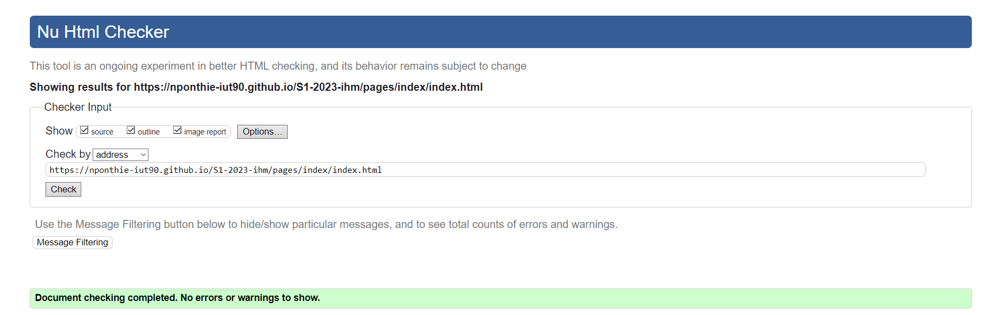
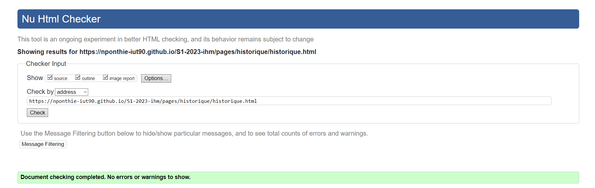
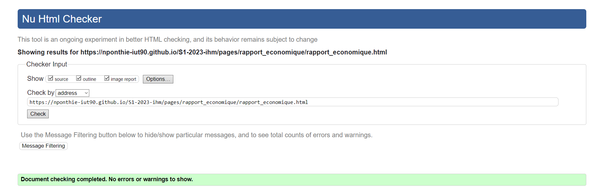
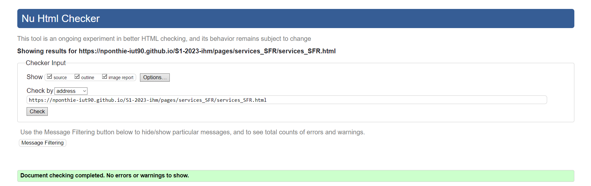

# Site_web_SFR

création d'un site web fictif présentant l'entreprise SFR.

[Page d'accueil](https://nponthie-iut90.github.io/S1-2023-ihm/)
## Membres du groupe :

Etudiant 1 (référent du groupe) :  [Nathan PONTHIEU](mailto:nathan.ponthieu@edu.univ-fcomte.fr?subject=SAE_1_05_06)  
Etudiant 2 : [Mickaël Marco](mailto:mickael.marco@edu.univ-fcomte.fr?subject=SAE_1_05_06)   
Etudiant 3 : [Simone-Désirée ZIGGAR](mailto:simone_desiree.ziggar@edu.univ-fcomte.fr?subject=SAE_1_05_06)  
Etudiant 4 : [Ibrahima NGOM](mailto:ibrahima.ngom@edu.univ-fcomte.fr?subject=SAE_1_05_06)  

# Présentation du projet

Nous sommes un groupe d'étudiant de l'IUT Nord-Franche-comté qui, dans le cadre d'une situation d'évaluation et d'apprentissage (SAÉ),doit créer un site web présentant une entreprise française du secteur informatique.
Nous avons choisis l'entreprise SFR car c'est une société française avec un parcours intéressant, qui a concurrencer France-télécom à ses débuts et qui a sû être une alternative sérieuse aux concurrents. Dans le cadre de cette SAÉ, SFR(fictif), nous demande de créer un site web pour présenter leur entreprise. Nous devons donc créer un site web qui répond aux attentes du client.

## Choix de conception  

Pour la conception du site, nous nous sommes grandement inspirés du site de L'INSA (disponible [ici](https://www.groupe-insa.fr/)), et nous avons pris comme référence la charte graphique de SFR disponible [ici](https://www.sfr.fr/).    

## Développement Site Web et Validation des pages

### Page d'accueil

**Auteur : PONTHIEU Nathan**  

Vérification W3C : [Détail ICI](https://validator.w3.org/nu/?showsource=yes&showoutline=yes&showimagereport=yes&doc=https%3A%2F%2Fnponthie-iut90.github.io%2FS1-2023-ihm%2Fpages%2Frapport_economique%2Frapport_economique.html)

### Présentation de SFR

**Auteur : NGOM Ibrahima**  

Verification W3C : [Détail ICI](https://validator.w3.org/nu/?showsource=yes&showoutline=yes&showimagereport=yes&doc=https%3A%2F%2Fdemo-am90.github.io%2Fs1-demo%2Findex.html)

### Rapport économique

**Auteur : MARCO Mickaël**

Verification W3C : [Détail ICI](https://validator.w3.org/nu/?showsource=yes&showoutline=yes&showimagereport=yes&doc=https%3A%2F%2Fnponthie-iut90.github.io%2FS1-2023-ihm%2Fpages%2Frapport_economique%2Frapport_economique.html)

### Services SFR

**Auteur : ZIGGAR Simone-désirée**

Verification W3C : [Détail ICI](https://validator.w3.org/nu/?showsource=yes&showoutline=yes&showimagereport=yes&doc=https%3A%2F%2Fnponthie-iut90.github.io%2FS1-2023-ihm%2Fpages%2Fservices_SFR%2Fservices_SFR.html)

### Participation GitHub

## Répartition du travail

### Planification - Diagramme de GANTT

- PONTHIEU Nathan

### Questionnaire 1

- PONTHIEU Nathan

### Questionnaire 2

- PONTHIEU Nathan
- NGOM Ibrahima

### Recherches d'informations

- PONTHIEU Nathan
- NGOM Ibrahima
- MARCO Mickaël
- ZIGGAR Simone-désirée

### Rapport économique

- PONTHIEU Nathan
- NGOM Ibrahima
- MARCO Mickaël
- ZIGGAR Simone-désirée

### Développement site

- PONTHIEU Nathan
  - Page d’accueil
  - "Template" de page (Navbar/Footer)
  - Page d'accueil
- NGOM Ibrahima
  - Page de présentation
- MARCO Mickaël
  - Rapport économique
- ZIGGAR Simone-désirée
  - Services SFR
